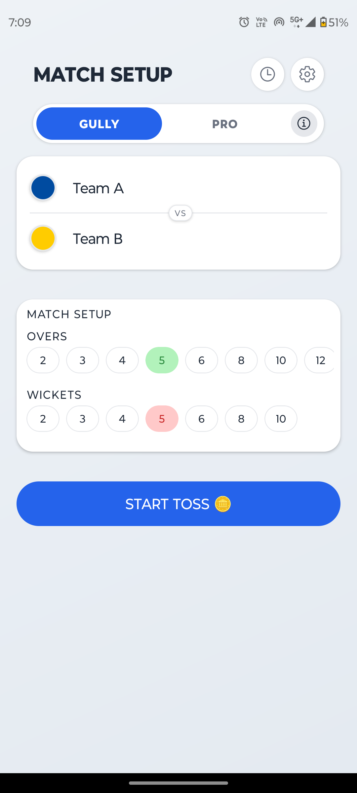
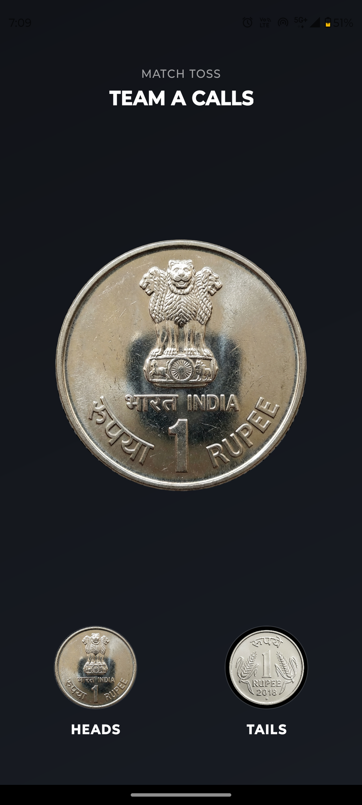
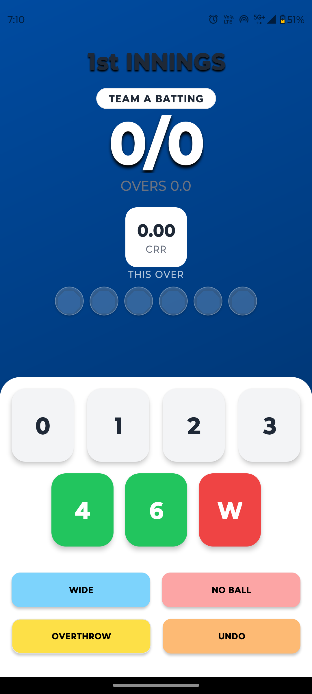
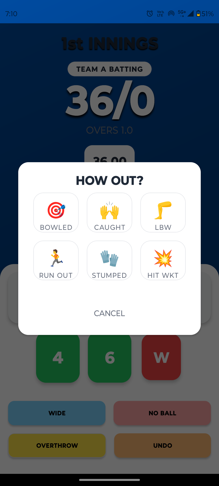
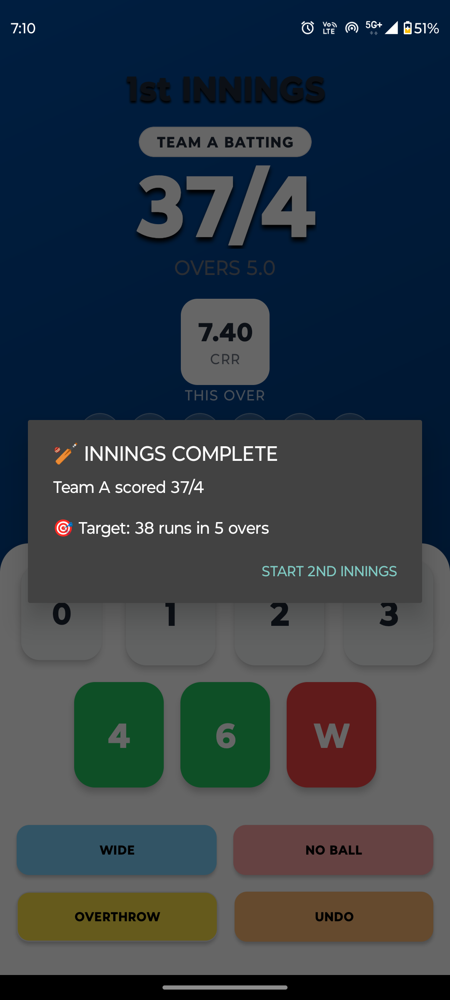
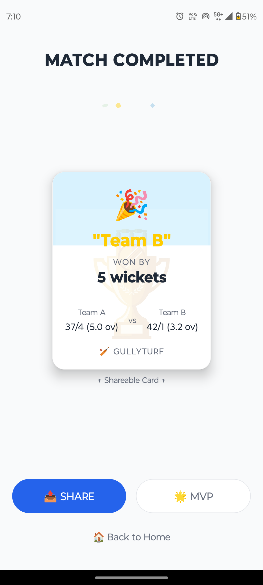
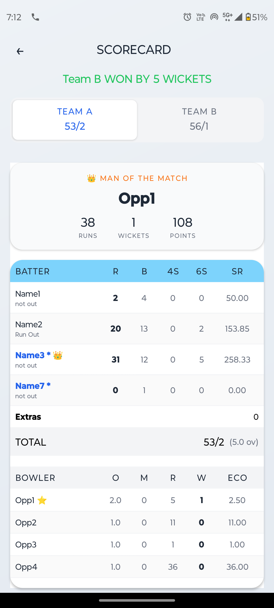
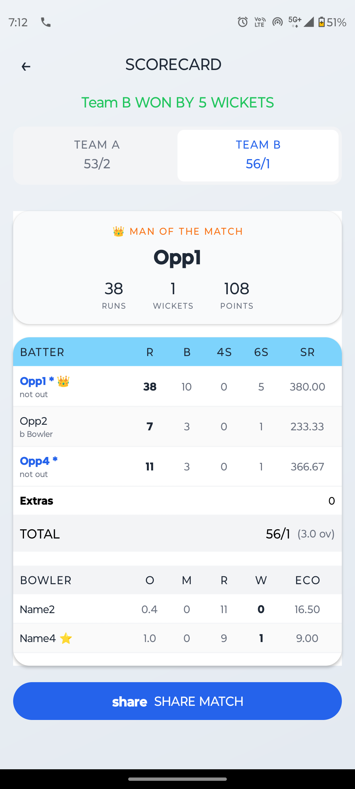

# 🏏 GullyCric – Real-Time Cricket Scoring App

A React Native mobile application designed to track cricket matches in real-time, specifically built for gully, turf, and local matches.

---

## 🚀 Features

* 🏏 Create and manage matches
* 🎯 Toss functionality
* ⚡ Ball-by-ball scoring system
* 📊 Real-time tracking of runs, wickets, and overs
* 📋 Detailed scorecard view
* 🧾 Match result tracking (win/loss)
* 📱 Fully offline functionality

---

## ⭐ Key Highlights

* Designed for real-world cricket scenarios
* Smooth and fast scoring experience
* Works completely offline
* Covers complete match lifecycle (start → end)

---

## 🛠 Tech Stack

* React Native CLI
* JavaScript
* Local state management

---

## 📱 Screenshots

### 🏁 App Flow Overview

  
  
  

  
  
  

  
  

---

## 📦 Download APK

🚧 APK will be added soon

---

## 🤔 Why I built this

Built to simplify score tracking for gully and local cricket matches where traditional scoring methods are inconvenient and error-prone.

---

## 🔮 Future Improvements

* Player statistics & analytics
* Match history tracking
* Cloud sync (Firebase)
* Ads integration for monetization

---

## 👨‍💻 Author

Abrar Ahmed
